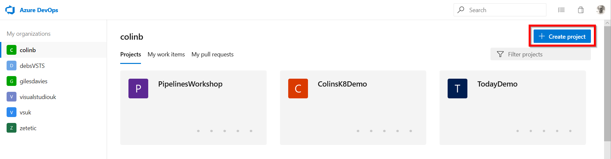
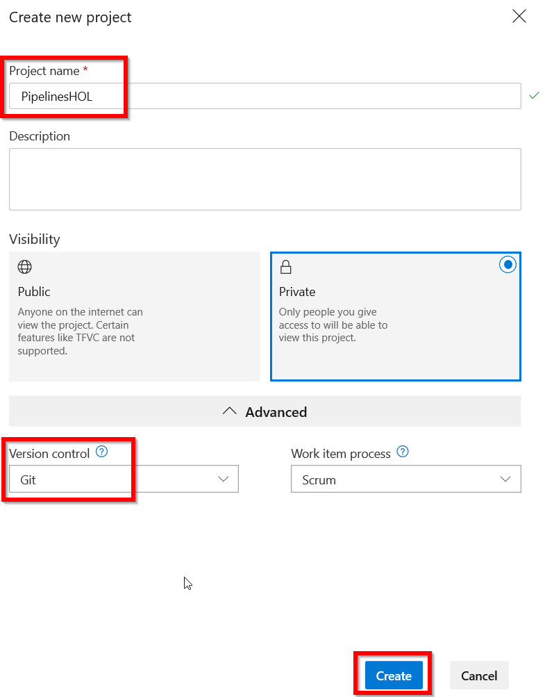
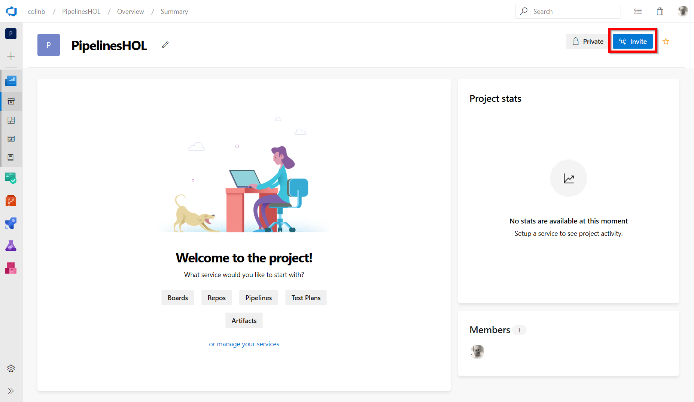

# Lab 1: Creating the project

## Task 1: Create the Azure DevOps Team Project

1. Open a browser and navigate to your Azure DevOps organisation. The old URL is  https://youraccountname.visualstudio.com and will work indefinitely or the new URL is https://dev.azure.com/yourorganisationname.
2. In your Azure DevOps organisation select Create Project.

3. Give the project a name, e.g. Web App. Make sure that version control is set to Git (select Advanced to show the options) and click Create. You could equally choose to use TFVC but this lab has documented the steps for using Git.

4. Your Azure DevOps team project has been created. You can add other people to the team if you want.

## Task 2: Cloning the Azure DevOps git repository to your local machine

Now your project is created it has an empty git repository ready for use from Azure Repos. We will need to put some code into this Repo when we setup our pipelines so lets get the code in place first. Note: Azure Pipelines can get code from other source code repositories like GitHub, Bitbucket etc.. however in this lab we will use the Azure Repos service build into Azure DevOps.

1. Head to Azure Repos using the menus on the left hand side.

2. Azure Repos will tell us the Repo created is empty and provides instructions for multiple ways to push code into this repository. For the lab today we are going to import the code from another repository so we need to select the option to import.

1. Import the code from my existing GitHub repository by using the following clone URL (https://github.com/colinbeales/AzurePipelinesHOL-Codebase.git). Select import and give a few seconds for the repository to be imported into your Azure Repos. You now have a complete copy of the repository and don't need my GitHub repo again. If you ever make any changes to the code you can do this within your own Azure Repo.

  
