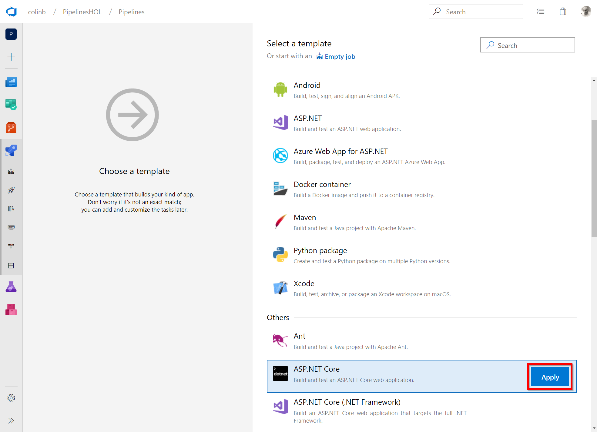

# Lab 2: Creating a continuous integration (CI) build pipeline

We have our code ready, but we need to build it, run units tests and package it ready for release. Compiling, testing and packaging are just a few of the sorts of activities that we commonly need to orchestrate in a build pipeline. In this lab we will create a build pipeline for our C# .NET Core application that aims to compile, test and package our application by orchestrating a series of tasks to take us to that end goal. This will set us in good stead to have a packaged application that we can in future labs deploy to our target Dev, QA and Production environements in Azure.

## Task 1: Create the build pipeline

1. Head to Azure Pipelines using the menus on the left hand side. By default it should select the first sub-menu for builds which is the area that we want to work within. With this screen open go ahead and select "New Pipeline"

2. It is highly likely you will see a screen like the one below, which is our YAML editing experience (a code first experience). For the labs we are going to be using the UI to create our pipelines so select "Use the classic editor", however later you may choose to create a new pipeline and try out the code-first YAML experience. If you have had a Azure DevOps organisation for a while it may still be that you don't see this screen and go straight to the classic editor, in which case go to the next step and you should be back with the flow of the lab.
   

1. We need to instruct the build pipeline where it needs to retrieve our code from. We have many choices of version control systems to select from as you can see on the right hand side , options like TFVC, GitHub, BitBucket and Subversion. For our lab we have placed the code into "Azure Repos Git" so we can select this. With this selected all the project, repository and branch details can be left alone as they are correct for the new repo we just imported all our code into. To move on click "Continue"
   

4. This screen is asking us for a template that best suits our build needs. I like to think of this being a choice of scaffold pipelines for many different technologies and platforms. Our application is an "ASP.NET Core" application so select this one. Be careful not to pick the .NET framework variant as this requires a Windows machine to build. In our lab we want the flexibility to run on Windows or Linux so we're going to select the "ASP.NET Core" option by clicking "Apply".

5. The screen being displayed is our build pipeline. There is a lot going on here if you are interested I've briefly detailed each of the eight entries that you might like to click on individually to understand what our pipeline is comprised of.

> 1) Overall pipeline setting are displayed here such as the pipeline name. Most crucially this states the default agent that will be used to execute the build. In our case a hosted (by Microsoft) Linux box is selected, but Windows or Mac could be selected and any of these platforms can be used on-premises on our own machines or hosted by Microsoft in the cloud.
>2) Get Sources settings. These are the version control settings we selected earlier but can be modified at any point.
>3) Agent Job settings. Any build can have many Agent Jobs in it and these in turn can have many tasks in each job. Imagine your build needed to build something on Linux and something on Windows or Mac. A different job could be selected allowing differing tasks to run on the Linux machine to the Windows/Mac job.
>4) Restore Task. This is our first task, one which does a dotnet core restore. This task will retrieve our dependencies from NuGet.
>5) Build Task. Once our dependencies are retrieved we can issue a build to compile our code with our dependent packages.
>6) Test Task. With our code built we can run any of our unit tests.
>7) Publish Task. Assuming all builds and tests run succesfully we are ready to create a deployment package.
>8) Publish Artifact Task. This is an important task to store all the artifacts we want for later, typicaly these are stored inside Azure DevOps. By default in our pipeline our artifact will only store the package prepared in the previous publish step before.

6. The build template by default is setup to store our deployment package once built, however we have a requirement to work with some other files namely some infrastrucure-as-code ARM templates. These ARM templates are currently in Git with our code but will be required in the release pipeline alongside the deployment package as we want to use DevOps best pactices that require our pipelines not only to deploy our application but to create the environments that we wish to deploy to. To achieve this goal we will need to add a copy task into the agent job that copies the ARM template files into the same location as our deployment package. Lets start doing this by selecting the "+" button in agent job to bring up the "Add Tasks" panel.

7. Search in the top right hand corner for the "Copy" task and when you see it drag and drop this task to the spot inbetween the "Publish" and "Publish Artifact" tasks as shown in the image below.

8. Lets fill in our Copy task which needs to copy our ARM templates to our Artifact Staging Directory. This staging directory is where our deployment package currently sits and is used by the final task in our pipeline to store all files for use later in our relase pipeline. Fill in the Copy Task with the following data to copy the appropriate files:
   > Display Name: Copy ARM Templates to: $(Build.ArtifactStagingDirectory)

   > Source Folder: $(Build.SourcesDirectory)

   > Contents: SimpleDotNetCoreApp.ARM/**

   > Target Foler: $(Build.ArtifactStagingDirectory)

9. We have one final change to make to make this build a continuous integration (CI) build (i.e. one that will trigger every new commit to the branch - in this case "master"). Click the "Triggers" tab and then "Enable continuous integration"

10. We're ready to kick off our build so lets select "Save and queue" from the menu. I've done this from the "Tasks" tab, but you can do this from any tab.

11. The "Save and queue" dialog gives us chance to override a few settings. We don't need to in this instance, but clicking "Save and queue" we will start our build pipeline which will execute on a hosted Linux build agent (a machine provisioned by Microsoft).

## Task 2: Build execution

Your build is now executing on a Linux build server provisioned by Microsoft in the cloud. If you're quick enough you can watch it as it completes the build that you just queued.

1. Click the link that appeared in the top left hand corner after you executed the build.

2. If you were quick enough you may see some the build providing a real-time stream of the work it is completing as it executes each of your tasks. You may have to watch for a minute or two as it completes your build.

Don't worry if you didn't see this build as it executed (I'm sure you'll catch a realtime view on a future build). Once the build completes you'll see the full build log and you can look at the artifact that the build produced (from the final "Publish Artifact" task). To do this select the "drop" artifact from the "Artifacts" dropdown in the top right corner. 

3. The Artifacts explorer allows you to see the files from your artifact staging directory that were published in the last task to a drop that will likely later be used in a release pipeline. You can see we can expand out the files and see our ARM templates have all been copied and crucially at the root we have our code packaged into a .zip file (SimpleDotNetCoreApp.zip). We can close the dialog we have finished the build pipeline lab.
   

[<- Lab 1: Create your Azure DevOps project](https://github.com/colinbeales/AzurePipelinesHOL/blob/master/AzurePipelinesLab1.md) | [Lab 3: Create a release pipeline ->](https://github.com/colinbeales/AzurePipelinesHOL/blob/master/AzurePipelinesLab3.md)
