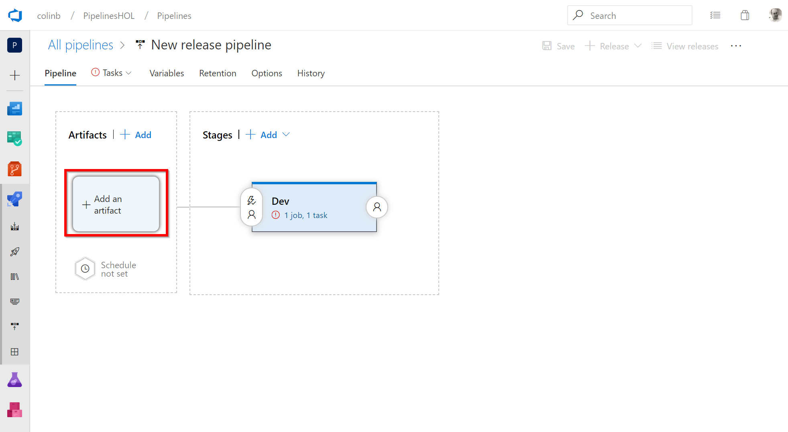

# Lab 3: Creating a release pipeline

Our previous lab had us create a deployment package and copy some infrastrucure-as-code templates into a drop artifact for use in this release lab. 

In this lab we will pick up from here to create a release pipeline to fulfil this job. We will use the pipeline to first create a "Dev" environment in Azure using an ARM template (a json document that describes resources to create in Azure). Our environment for this lab will be simple, just one PaaS Azure App Service that will host our web application. Once our environment is created in Azure we will deploy our package to it so that our web application will run.

## Task 1: Create a new release pipeline

1. Head to menus on the left hand side and select the releases icon under the pipelines icon (both are rockets). On selecting this you will be shown you have no release pipelines, but you can create a new one. Select "New pipeline" to do this.

2. In a similar style to the build which gave us a choice of pipeline templates, the same is true for a release pipeline. You will be greeted with a host of different templates of application types and platforms that you could use as a scaffold for a release pipeline. Take a second to scroll through the list and take in some of the options available. The one we want to select is "Azure App Service deployment" when you find it select "Apply" 

3. A release pipeline can have many stages. In our lab we'll eventually have stages for Dev, QA and Production but for now we'll just have one. Lets name this one "Dev" before we close the panel.

4. Our view now will be a visual representation of the artifacts and stages in our release. As we currently have no artifacts we will want this release to be triggered from the successful creation of a build (and the drop that was produced from this). Select "Add an artifact" so we can add our build as our artifact.
   

5. Artifacts could come from a range of different places, version control, builds and container registries to name a few. In our instance we want our release to come from an artifact created in our build from Lab 2 so make sure "Build" is selected and then in the "Source (Build pipeline)" select the CI build we created in the previous lab. The options should expand at this point but you can leave all the defaults as we are happy to use the latest build when we trigger releases by default. Select "Add" and we're done with adding the artifact.
 

6. Turning our focus to the visual diagram we can see we now have an artifact which will trigger our Dev stage. Our next steps will be to edit the pipeline for the Dev stage. Select the link in the centre (currently should say "1 job, 1 task") which will navigate us to the pipeline for this Dev stage. 

7. The editor displayed should look pretty familiar based on what we saw in a build. The release stage pipeline is setup very similarly to our build pipeline, with agent jobs hosting tasks. In this instance the scaffold template we picked simply put one agent job in place with one single "Deploy Azure App Service" task within it. We'll add more tasks to this screen later, but for now there are a few settings that its letting us know need attention. The first of these is the Azure Subscription that we want to deploy our .NET core web application into. Select your subscription from the drop down (it only knows subscriptions you are allowed to access under the user you're logged in against), once your subscription is selected click the "Authorize" button. The browser will pop-up an Azure login window as part of authorization so enter your Azure subscription credentials for authorization to complete. 
   

8. Having authorized our pipeline to use our Azure subscription we need to provide an "App service name" for the Azure App Service we wish to deploy to. We could hard code this value, but I prefer to use variables as they have more flexibility to set for an entire release (all stages e.g. dev, QA and prod) or have a stage specific value. The format for variables will be familiar to PowerShell users, therefore for a variable called WebAppName we use the \"$(WebAppName)" without the quotes. Once this is set, select the "Variables" tab where we can set a value for it.
 

9. Click the "Add" button to add a variable, then set the "Name" to be "WebAppName" and set a value. The value needs to be unique so use a value of your own here and append the word "Dev" onto the end. Finally set the scope to be "Dev". This means that this value will only be used in the "Dev" stage. Later when we create QA and Production stages we can set different values for each environment. We're done with this screen for now so lets return to the tasks in our pipeline by clicking the "Tasks" tab.

10. We have a task to deploy an App Service, however the App Service deployment wont work because nothing has created that "App Service" in Azure yet. To do this we could manually go and setup a new App Service in the Azure Portal, however with a DevOps mindset we should prefer to auomate the creation into our pipeline and we use infrastructure-as-code to do this. There are multiple ways to do this in Azure, however for this lab we will use an Azure Resource Management (better known as ARM) template to do this.

    To add a task to the pipeline is the same process we used to add tasks to the build pipeline. Select the "+" on the Run on Agent job, then search the tasks by typing "ARM" into the seachbox. From the search results drag and drop the task using the handle into the pipeline into the position before our existing "Deploy App Service" task.

    
11. There are a number of settings that need changing on this new task so select the "Azure Resource Group Deployment" task and start setting required properties. The settings should be:
* Azure Subscription - Select the Azure subscription we authorized earlier in this lab
* Resource Group Name - "AzurePipelinesLabGroup" 
* Location - I'm picking "UK South" as its nearest me, but you may wish to pick a closer region if your sitting this lab in another region.
 

Scrolling down we have some further settings on this task we need to set, each one by selecting the ellipsis "..."

The template and the template parameters fields can be set by following the dialog to find the ARM json files that describe the resources that we want to create in Azure. You can select "WebSite.json" for the template field and "WebSite.Parameters.json" for the template parameters field.  

The override parameters field can be used to override parameters that will be used in the ARM template. 
This is a chance for us to provide a WebAppName for the App Service that we are going to create. Change the null variable here to the "$(WebAppName)" variable we created earlier. This will mean this task will create the same App Service resource that we deploy to in the next pipeline task.

12.  Before we save our release pipeline lets select the name "New release pipeline" at the top of the screen and give a new more meaningful name like "Pipelines Lab AppService Release". We can now click "Save" to save our release pipeline.

The Save dialog can have a comment for history, but we'll just select "OK" so the save is complete.

## Task 2: Execute a release on using the new release pipeline

1. Let's kick off a new release by selecting "Create release" from the "Release" dropdown.
  

2. The create a new release screen gives a chance to confirm which artifacts will be released, we only have our one build artifact so we can leave everything as is and click "Create"
    

3. As we saw with our build we can click the notification link at the top of the screen to see the progress of our release. Click "Release 1" at the top to see this.
    

4. If you catch the release in-progress you can click the "In-progress" link to see each step in your pipeline executing in real time. If the release is completed the "In-progress" link is replaced with a "Completed" link that you can click.
        

5.  Depending on how quickly you clicked through you will either see the steps executing or see all the steps completed meaning our deployment has been successful creating a App Service in a "Dev" environment and deploying our build to this service.
    

Next we will look to add to this release by adding additional release stages for our QA and production environments.

[<- Lab 2: Create a continuous integration build](https://github.com/colinbeales/AzurePipelinesHOL/blob/master/AzurePipelinesLab2.md) | 
[Lab 4: Add additional release stages ->](https://github.com/colinbeales/AzurePipelinesHOL/blob/master/AzurePipelinesLab4.md)
