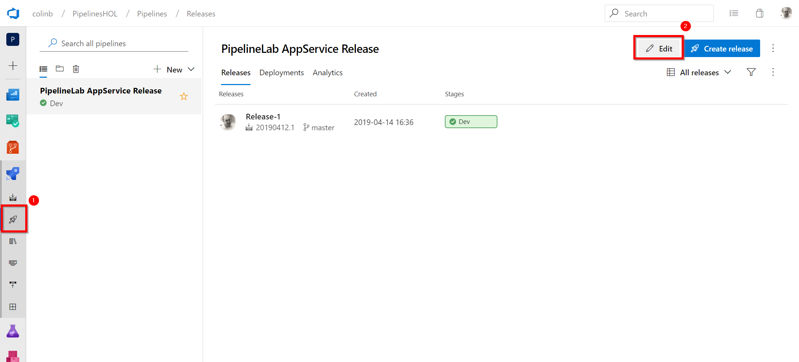
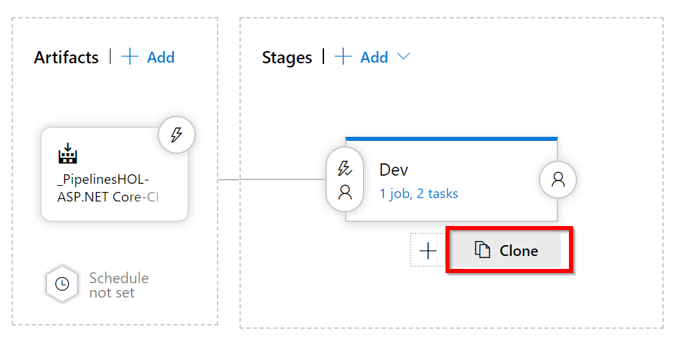

# Lab 4: Add additional release stages 

Our release so far has only one stage, representing a deployment to one environment (i.e. Dev). In this lab we are going to expand the amount of stages in our release so that we have additional stages to represent deployments to QA and Production. 

## Task 1: Adding additional release stages

1. Head to menus on the left hand side and select the releases icon under the pipelines icon (both are rockets). Click "Edit" to edit our release pipeline.

2. On the graphical editor canvas hover the mouse just under the Dev stage and two buttons below will appear. One adds a new stage to the pipeline the other however will clone this one, which in this lab is what we want to do in order to get a replica stage in QA as in Dev. So click "Clone"
   

3. We now have a Copy of Dev stage so we're going to need to rename this so click on the title "Copy of Dev" to bring up the settings for this stage.

4. In the settings panel rename the Stage name field from "Copy of Dev" to "QA" and then click the "X" in the top right corner to exit the settings panel.
   

5. We're going to go through the cloning process one more time. This time hover under the QA stage and click the "Clone" button.

6. Again we need to rename so click "Copy of QA" to bring up the stage settings panel.
   

7. Rename the Stage name from "Copy of QA" to "Production" and exit the settings panel.

8. We now have three seperate stages, but remember the variable we set in the previous lab, it was set to create and deploy to a WebAppName with a very Dev specific unique title. We need differing names for QA and Production now so click the "Variables" tab so that we can set these.
   

9. You can see that our cloning operation has added two additional variables to the one we entered previously. Change your unique WebAppName different names for QA and Production. I recommend appending "QA" or "Prod" to the end of the value. Once you're done lets click "Save" to persist our changes.

10. Once again we don't need to comment in the Save dialog, so just click "OK" and our pipeline changes are done we just need to execute a release.

## Task 2: Execute a release on using the new release pipeline

1. Let's kick off a new release on our pipeline by selecting "Create release" from the "Release" dropdown.
  

2. Our settings page for creating a release indicated that we will be releasing to more stages than just Dev that we saw last time. Everything here is therefore best left untouched so just click "Create" to set off our release.
   

3. To watch our release again we can click the link that appears in the notification banner towards the top of our page. Click the "Release 2" link to see the progress on executing our pipeline.
   

4. We should be able to watch progress as our deployment takes place over Dev, QA and Production stages one by one. Note: Remember you could click "succeded" or "In-progress" on any stage to further drill into the logs being produced for each stage as the agent job executed our release.
   

5. We're pretty much done for this lab. If you load up your Azure susbcription in https://portal.azure.com you will see you have a new resource group created and within this are each of our App Services, one per environement. Note: App Service has a feature called slots that you would probably use in a non-lab environment which would mean you'd have one App Service with multiple slots on it, rather than what we created today. However we're done for this lab, our next one will add some approvals to the pipeline so we can sign-off each environement rather than just deploying all the way to production without a pause.
    

[<- Lab 3: Create a release pipeline](https://github.com/colinbeales/AzurePipelinesHOL/blob/master/AzurePipelinesLab3.md) | [Lab 5: Add approvals ->](https://github.com/colinbeales/AzurePipelinesHOL/blob/master/AzurePipelinesLab5.md)

