# Lab 5: Add approvals to the pipeline
When we deployed our release pipeline from the last lab it deployed to each environment (Dev, QA and Production) one by one without a pause. It is common to want some kind of sign-off in-between stages where validation can be done and signe-off against before deployment progresses to the following stage. In this lab we will put in such a sign-off.

## Task 1: Adding our approvals

1. Head to menus on the left hand side and select the releases icon under the pipelines icon (both are rockets). Click "Edit" to edit our release pipeline.

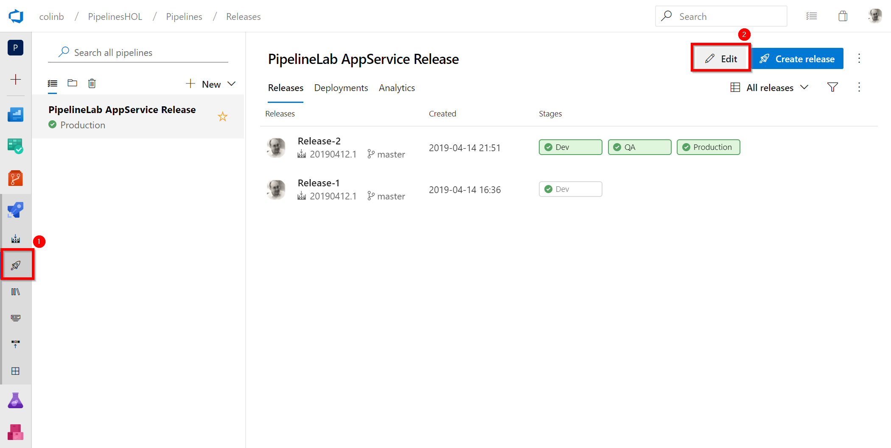

2. On the visual canvas of our pipelines there are icons on each stage to the left and right hand side. These icons allow us to setup pre (left) and post (right) conditions which approvals are part of. We'll setup both a pre and a post condition for our pipeline so lets start with a post deployment condition by clicking the icon on the right side of the Dev. Post deployment condition means Dev will deploy and then we will be required to sign-off before the pipeline moves to the next QA stage. Click the icon now.
   
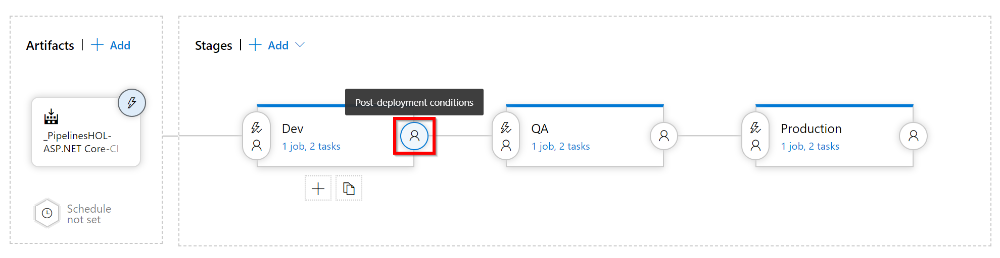

3. In the post deployment conditions panel firstly "Enable" post deployment approvals. You will then be asked for a user or a group (or both) to sign-off this approval. In this instance we'll say anyone in our team. The easiest way to do this is to look at our project name (in green on the below image) and start typing this into the approvers field and selecting the team from the dropdown. Once this is done you can close the post deployment conditions panel.

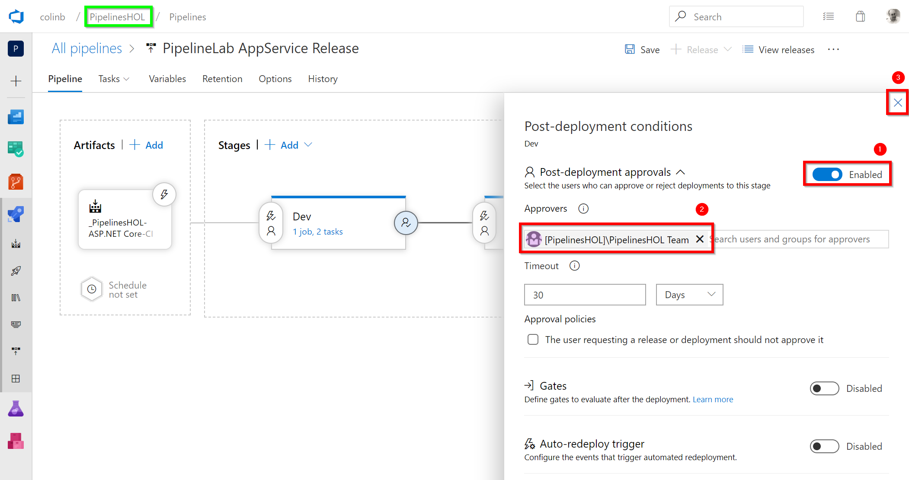

4. Back at the visual canvas you can see (marked in green on the image below) that a small tick has appeared on the icon denoting we have a post deployment condition set for the Dev stage. Lets setup a pre-deployment condition for production so a sign-off is required before a production deployment takes place. To do this click the icons to the left of the Production stage.
   
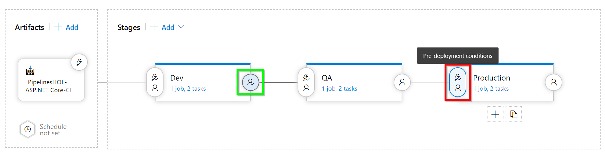

5. There are a few more options on this pre-deployment conditions panel surrounding elements like triggers, however we need to scroll down and enable "Pre-deployment approvals". This time rather than adding a group as the approver add your name denoting that you and only you can sign-off going into production for this lab scenario. With these set you can exit the pre-deployment conditions panel.
   
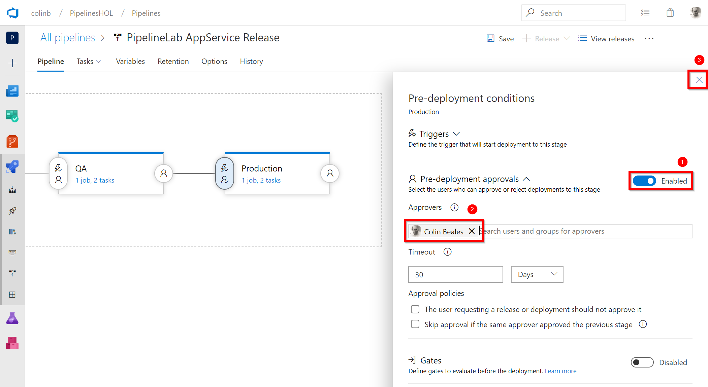

## Task 2: Turn on continuous deployment.

1. At this point we could trigger a deployment like we've done previously, however to change the scenario at little we are going to enable continuous deployment. This will mean that every new successfull build will trigger our release automatically and be subject to the new approvals we have just created. To do this select the small lightening bolt icon in the top right hand corner of our build artifact.
   
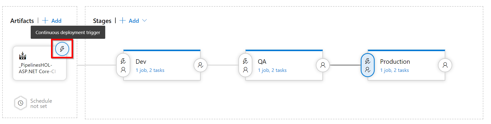

2. The continuous deployment trigger on the shown panel just needs to be set to "Enabled" and then we can exit out of the panel.

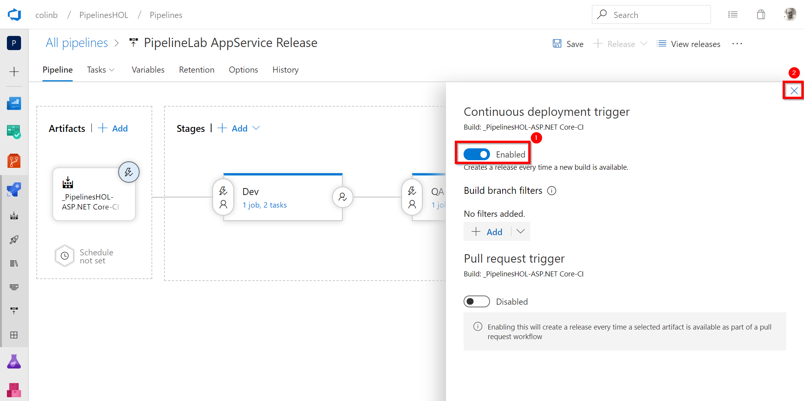

3. Having made our approval changes and our continuous deployment change lets do a quick "Save" to ensure our work is persisted.

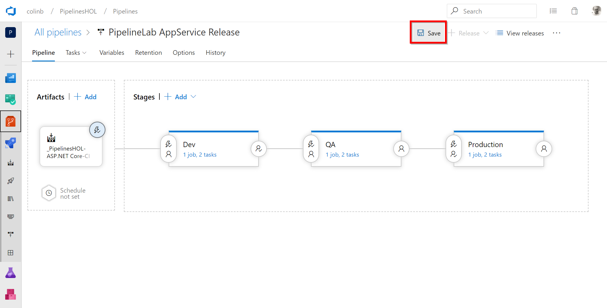

4. As always we need no comment for the Save dialog so just click "OK"

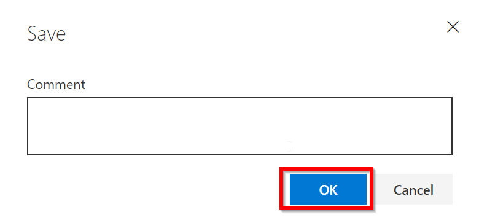

## Task 3: Execute a continuous deployment release from a new commit.

1. Having made all our changes we want to trigger a new continuous integration build (CI) which will in turn if successful trigger a continuous deployment release (CD). First of all lets go make a code change from Azure Repos so head to the menu on the left for Azure Repos select the sub-menu "Files"

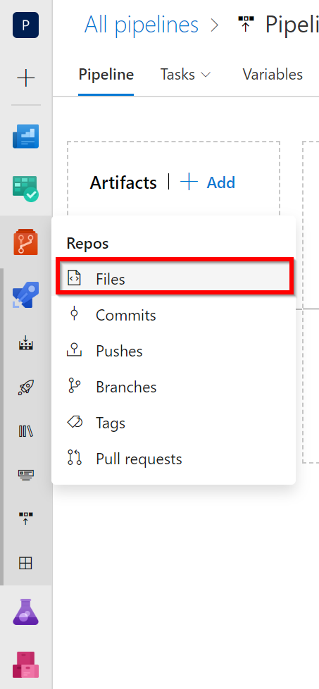

2. On the left hand side a tree-control structure allows us to navigate the folders and files in the repo. Drill down into the "SimpleDotNetCoreApp" folder, then into "Views" and into the "Home" directory. Inside of "Home" select the "Index.chtml" file and then select "Edit" so we can make a change to this source file.

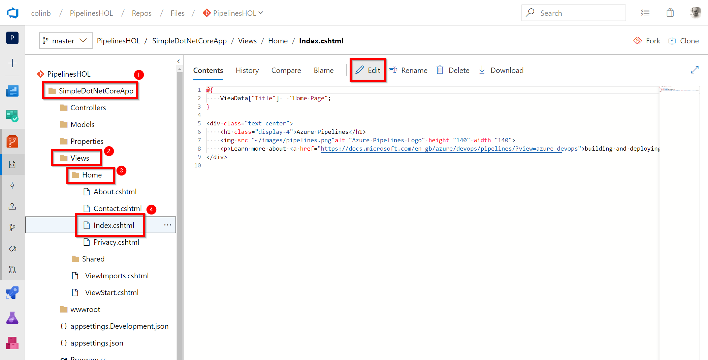

3. We can now make a nice visible change into our view so we'll know that our code has been modified and deployed later. Append to the H1 tag the word "Modified". With this done click "Commit" to add this change into our repo.
   
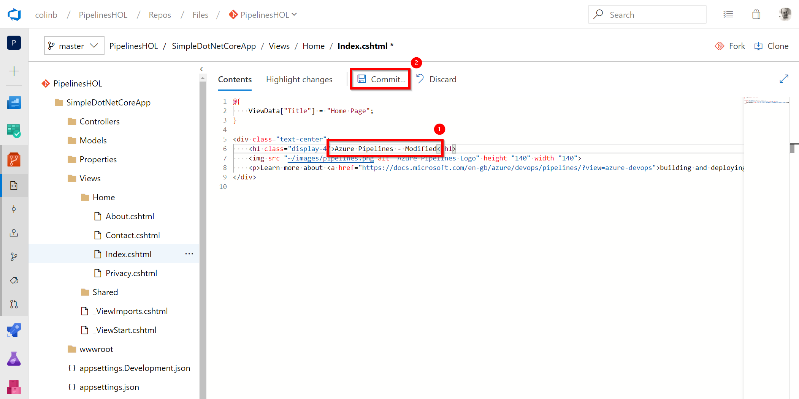

4. The commit dialog needs no changes so just click "Commit" and a new change will be persisted to the repo, which in turn will trigger a CI build and a new release triggered by continuous deployment.
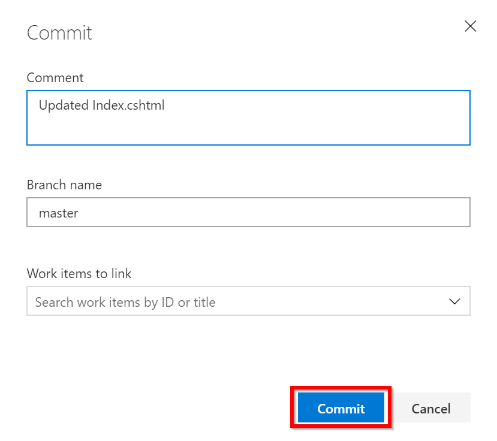

5. Lets check our build is executing by heading back to the builds area of pipelines using the menus of the left and selecting the sub-menu option of "Builds".
   
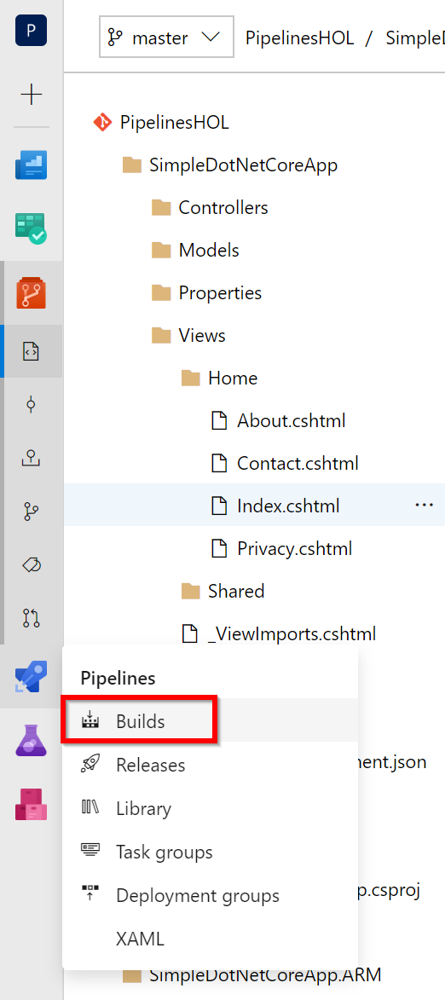

6. The builds screen should show our build and the new build either executing or completed. The image below in green shows the area to check which has a blue icon if the build is executing and a green tick once the build is complete. Wait until this has a green tick and then we'll know our build was succesful and our continuous deploy release will have been triggered.
   
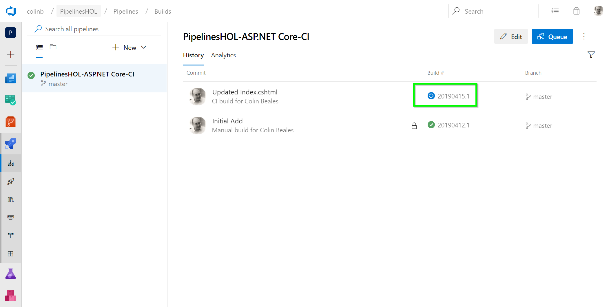

7. To check on our continuous deployment release lets head to the "Releases" area from the menu and sub-menu on the left hand side (the small rocket).
   

8. The releases screen should show the progress of the deployment out to the Dev stage of our pipeline. Once Dev has deployed our post-deployment approval will be required before anything progresses further. You will see a blue clock icon when an approval is required. It's worth noting that a notification email would be sent at this point, but we can respond directly from this screen by clicking the "Dev" stage with the blue clock icon.
   
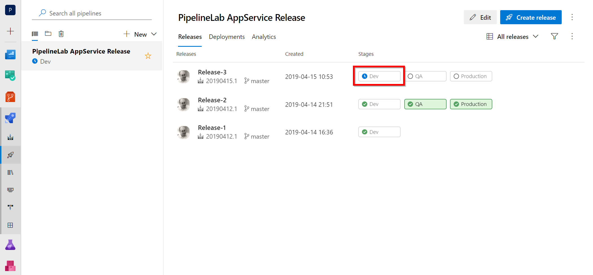

9. (Optional step) Before we sign-off our release it may make sense to actually check that we have successful deployment of the modified code. Create a new browser tab and head to the "https://uniquewebappnamedev.azurewebsites.net" url. Remember "uniquewebappnamedev" will be different for your instance to the value you input to the variable for WebAppName in the release pipeline for the Dev stage. You should see something like the below image with the area in green showing the "Modified" change.
    
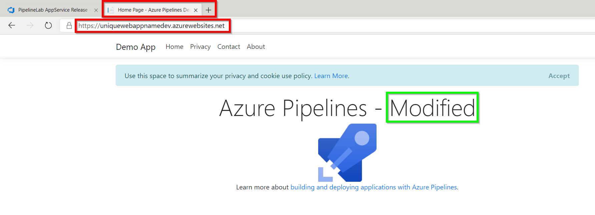

10. We are now ready to do our approval so click "Approve".
    
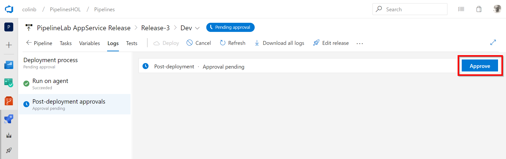

11. The post-deployment approval panel allows us to make a comment that would be available at a later date for auditing reasons. We don't need to fill this out today so just click "Approve".
    
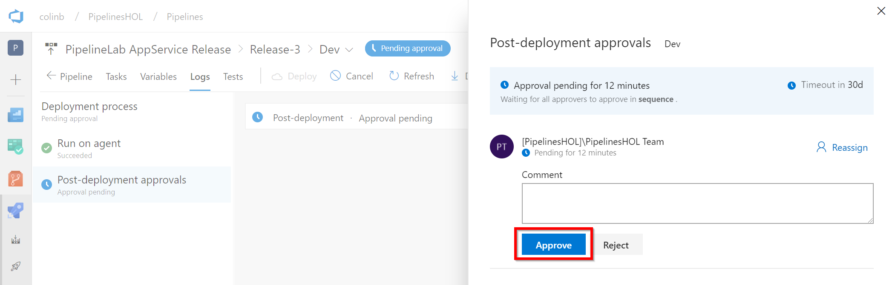

12. Our approval is now done, so lets exit from the post-deployment approvals panel.
    
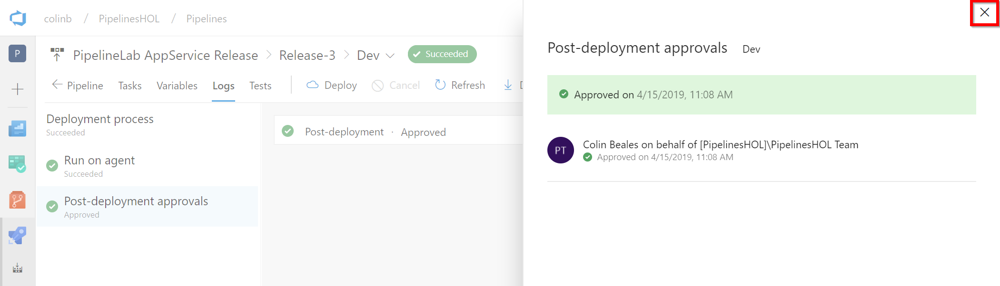

13. With the approval done our pipeline should be now executing the QA stage of our pipeline. Lets go check on this by selecting "Release 3" from the breadcrumb menu at the top.
    
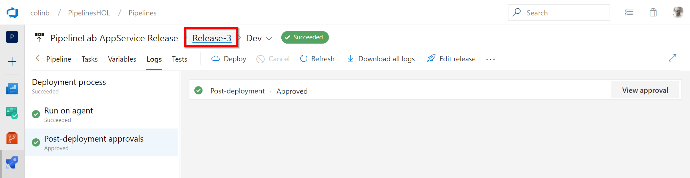

14. If you got to this point whilst the deployment is still occuring the QA stage will be "In progress" keep refreshing this screen until QA shows as "Suceeded". The "Refresh" button can be found in the toolbar above the visual canvas.
    
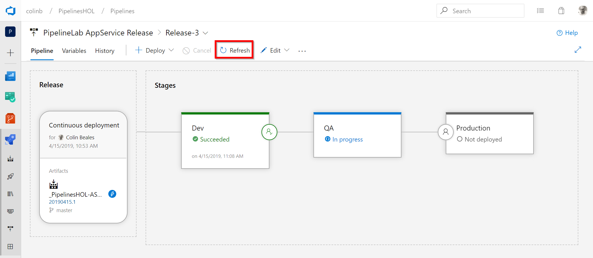

15. Once QA has succeeded we should see a screen like the one below. This screen is another which allows you to see an approval is needed. This time its the pre-deployment approval for production which needs signing off before a production deploy will take place. To do this Click "Approve" under the box for the production stage.

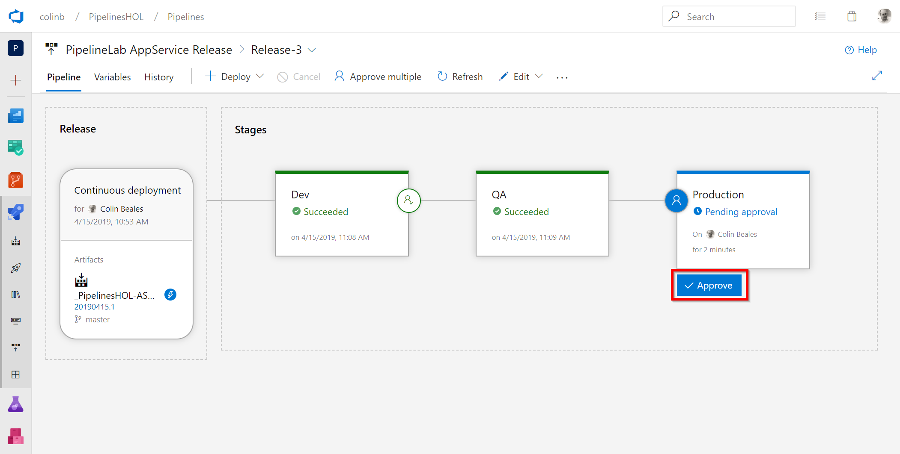

16. Once again for our approval we don't need and audited comment so lets just click "Approve". Note: Pre-deployment conditions enable you to select "Defer deploying for later" this is useful for scenarios where you want to sign-off at this point but have the deployment actually take place later. An example of this might be signing off a production release on a Friday afternoon and deferring the deployment to trigger at a listed time at the weekend. We don't need to do this today as we want our deployment to immediately take place.
    
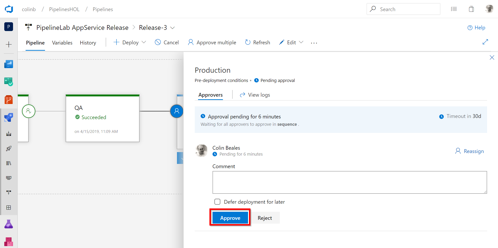

17. Again close the approvals panel by selecting the "X" button.
    
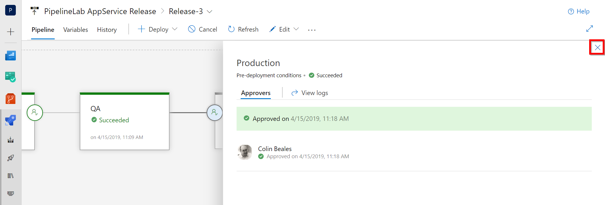

18. Production should now be deploying or deployed. When you see that all three stages have succeeded you have completed this part of the lab and have setup a build and release pipeline. You now have the skills to try other types of build/deployments with Azure Pipelines. 
    
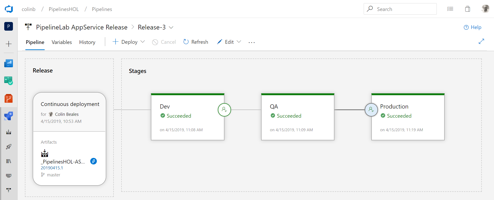

[<- Lab 4: Add additional stages](https://github.com/colinbeales/AzurePipelinesHOL/blob/master/AzurePipelinesLab4.md) | [(Advanced) Lab 6: Create a CI build for a docker container ->](https://github.com/colinbeales/AzurePipelinesHOL/blob/master/AzurePipelinesLab6.md)