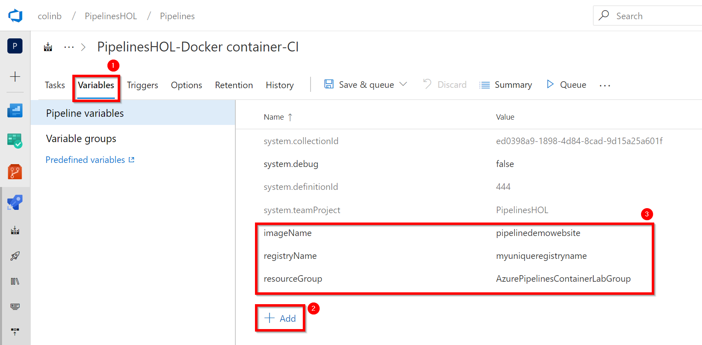

# Lab 6: CI Build for a Docker Container
In this lab we will start on a journey to build and deploy the same web application, but this time we will building and deploying the appication by using docker containers. This lab will look to create a new build pipeline to build our container, the next application will look to deploy it. Once again we will look to use infrastructure-as-code via ARM templates that will create the resources that we need in Azure, which for this build pipeline will create a private container registry using Azure Container Registry and in the next lab will create the nessisary Azure resources to host our container making it accessible from the internet.

## Task 1: Building a pipeline for a docker container

1. To start building our container we are going to need a new build so head to the menus and select the "Builds" submenu from the Pipelines section.

2. We have one pipeline from the last lab already created so lets head to the "New" dropdown and select "New build pipeline" to start a new one for our container build.
   

3. Once again we're going to use the UI based editor rather than YAML so click "Use the classic editor". 

4. Once again we know our source code is going to be in our Azure Repos repository in the Master branch so we should be able to stick with the defaults here and click "Continue"
   

5. For the template to start with lets find the template for "Docker container" as that will be a good start point and click "Apply"
   

6. This time we're going to set all our variables up all at once, later we'll use them in the tasks in the pipeline. Click the "Variables" tab to get to our entry screen and add the following names and values.

| Name | Value|
|------|------|
|imageName|pipelinedemowebsite|
|registryName|myuniqueregistryname|
|resourceGroup|AzurePipelinesContainerLabGroup|

The registryName value needs to be globally unique so think of something unique to you as a name for your Azure Container Registry and enter in in lower case.

7. With our variables done we can click the "Tasks" tab to focus our attention to the tasks we need in our pipeline. We'll need to add a few tasks so click the "+" on our agent job to bring up the add tasks dialog and search "ARM" to find the "Azure Resource Group Deployment" task. When you find the task use the UI to drag and drop the task into your pipeline placing it as the first task before the existing "Build an image" task.
   

8. Now using the add tasks dialog which should still be open search with the word "Copy" to find the "Copy files" task. Once you find this again drag and drop it into your pipeline, this time placing the task after the "Push an image" task.

9. We've one more task to add so search again for "Publish Build" and find the "Publish Build Artifacts" task and add this by dragging it and droppin it to the end of the pipeline just after the "Copy files" task you added in the previous step.

10. We need to configure the tasks in the pipeline as they wont work as required with all the defaults so lets go through the changes we need on the tasks. First click the "Azure Resource Group Deployment" task you added at the start. This task will be used to Create our Azure Container Registry which we will use as a private and secure storage location for our docker container. With this selected you can change the desired fields which are:
* Display name - "Create Container Registry in AzurePipelinesLabGroup"
* Azure Subscription - Select the Azure Subscription you wish to deploy to, assuming this is the same you've used before you will not need to Authorize again.
* Resource Group - Use our variable "\$(resourceGroup)"
* Location - "North Europe". Whilst previously I used UK South we will later need a service "Azure Web App for Containers" which isn't at the time of writing available in this region so we'll use "North Europe"
* Template - Use the "..." to find the file "ContainerRegistry.json" which should be in our "SimpleDotNetCoreApp.ARM" directory.
* Template parameters - Use the "..." to find the file "ContainerRegistry.parameters.json" which again will be in our "SimpleDotNetCoreApp.ARM" directory.
* Override parameters - Use the "..." elispses to bring up the parameter override dialog and enter "\$(registryName)" as the value for the Registry Name.
    

11. Lets click on the "Build an image" task an make changes here to ensure that our dockerfile is built into a container. You can change the desired fields with these settings:
* Azure Subscription - Select the Azure Subscription you wish to deploy to, assuming this is the same you've used before you will not need to Authorize again.
* Azure Container Registry - "\$(registryName).azurecr.io" can be added here as it can use our registry name variable to make up the registry url.
* Image Name - "\$(imageName):\$(Build.BuildId)" can be user here to use our image name variable along with our build id to identify this build of our image in the registry.
    

12. Moving onto the "Push an image" task by a quick click means we can push our newly built container into the Azure Container Registry. You can change these same familiar fields from the last task to make this happen:
* Azure Subscription - Select the Azure Subscription you wish to deploy to, assuming this is the same you've used before you will not need to Authorize again.
* Azure Container Registry - "\$(registryName).azurecr.io" can be added here as it can use our registry name variable to make up the registry url.
* Image Name - "\$(imageName):\$(Build.BuildId)" can be user here to use our image name variable along with our build id to identify this build of our image in the registry.
   

13. Click onto the "Copy files" task as we need to configure this to copy our ARM templates into our \$(Build.ArtifactStagingDirectory) which we will then publish into an artifact drop to be used in our continuous deployemnt release pipeline. Change the following values:
* Display name - "Copy ARM templates to \$(Build.ArtifactStagingDirectory)"
* Source folder - Either type "SimpleDotNetCoreApp.ARM" or use the "..." elipses to select this folder from the file/folder picker.
* Target folder - "\$(Build.ArtifactStagingDirectory)" 
  

## Task 2: Execute the build for a docker container

1. Luckily the "Publish Artifact Drop" task already creates a drop from \$(Build.ArtifactStagingDirectory) so we don't need to configure the last task from the defaults. We are now good to pick "Save & queue" from the "Save & queue" drop down. To execute our build.

2. Click "Save & queue" on the confirmation dialog to save our build pipeline and to queue it against the "Hosted Ubuntu" pool. This will trigger a build to execute on a Microsoft hosted linux server hosted in the Azure cloud.

3. As our build is executing we can follow the usual notification link at the top of the screen to see its progress. "Click" the link now.

4. If you arrived at this point early enough you will see the usual real-time update of the build executing, if this is the case wait until the build finishes, at which point it should look similar to the below image and this part of the lab is done and we're ready to move onto creating a release to create a resource in Azure to host our container and deploy to that.

[<- Lab 5: Add approvals](https://github.com/colinbeales/AzurePipelinesHOL/blob/master/AzurePipelinesLab5.md) | [(Advanced) Lab 7: Create a release pipeline to run a container ->](https://github.com/colinbeales/AzurePipelinesHOL/blob/master/AzurePipelinesLab7.md)
