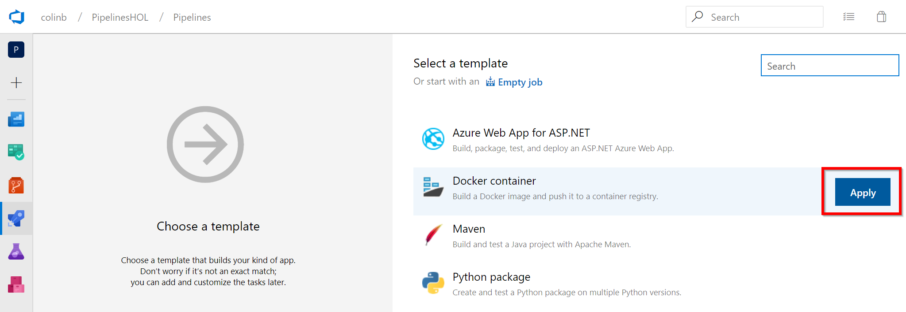
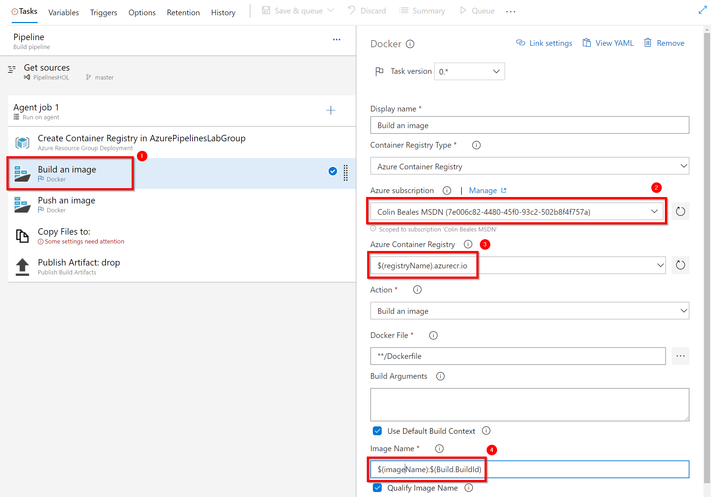

# Lab 6: CI Build for a Docker Container
Not done yet

## Task 1: Adding our approvals

1. Not done yet

[<- Lab 5: Add approvals](https://github.com/colinbeales/AzurePipelinesHOL/blob/master/AzurePipelinesLab5.md) | [(Advanced) Lab 7: Create a release pipeline to run a container ->](https://github.com/colinbeales/AzurePipelinesHOL/blob/master/AzurePipelinesLab7.md)
