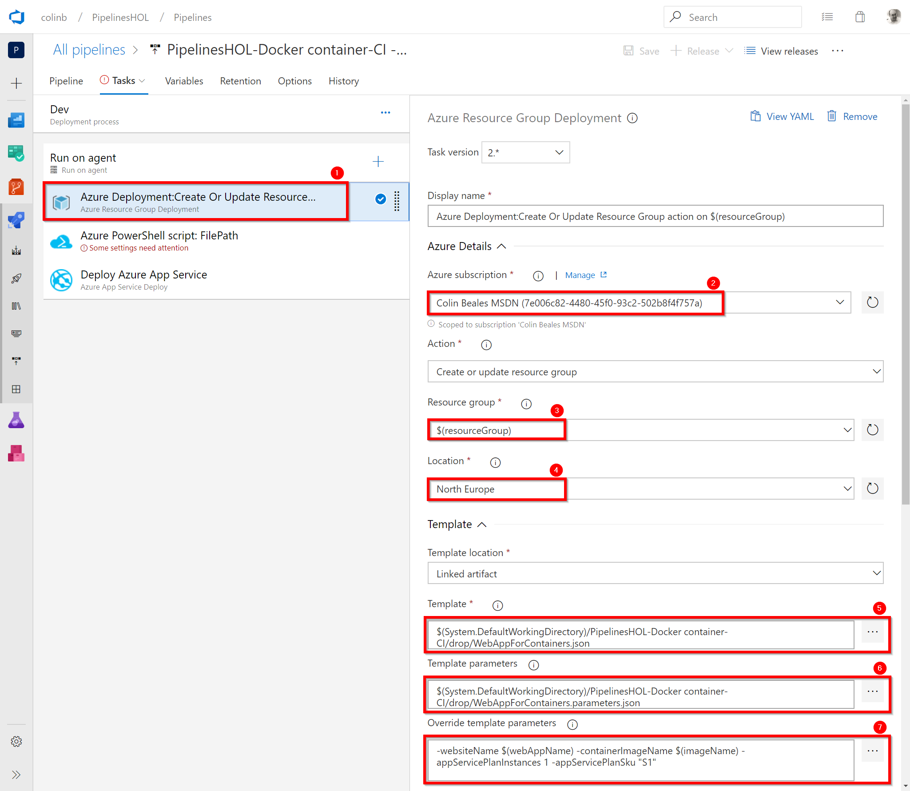

# Lab 7: CD Release for a Docker Container
Not done yet

## Task 1: Creating the pipeline

1. Not done yet

[<- (Advanced) Lab 6: Create a continuous integration build for a docker container](https://github.com/colinbeales/AzurePipelinesHOL/blob/master/AzurePipelinesLab6.md)
| [(Optional) Hack: Ideas for other pipeline work to extend workshop learning ->](https://github.com/colinbeales/AzurePipelinesHOL/blob/master/AzurePipelinesLab8.md)

