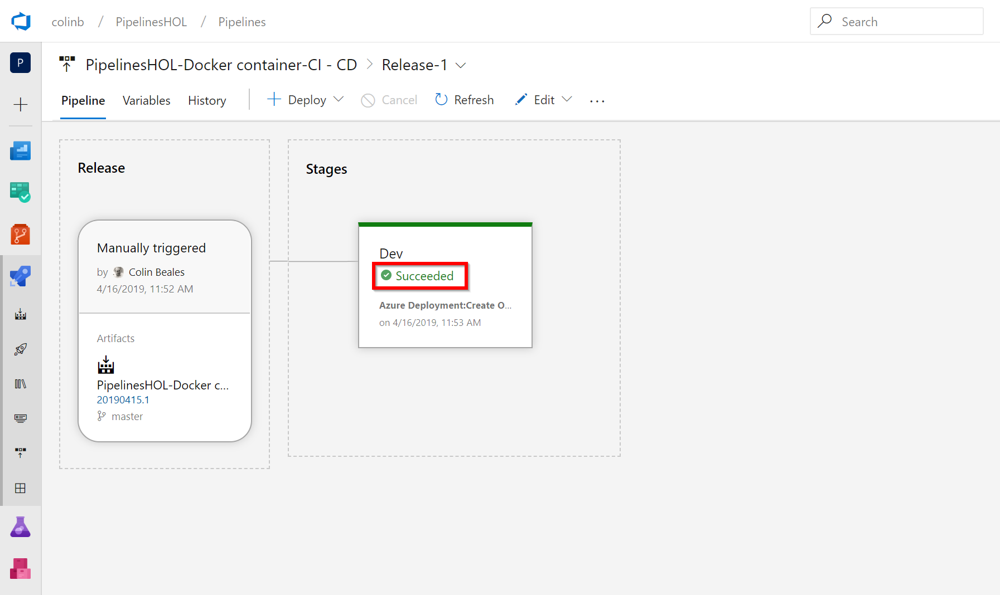

# Lab 7: CD Release for a Docker Container
We've built our docker container and pushed this into a private, secure Azure Container Registry. This provides us storage for our container, but we will want to host this container in Azure to provide the compute that enables this container to run. 

Azure has many choices to host an container such as AKS, a managed Kubernetes service, Azure Container Instances as a simple container host, however in this Lab we will use Azure App Service again and it's Web App for Containers service to simply host a web application or API from a flexible host that can scale to our needs.

## Task 1: Creating the release pipeline

1. Picking up from where we left off in the last lab in the logs page of our container build pipe that we executed you'll notice a "Release" in the top right corner that you can click. 


2. Pressing the "Release" button from a build gives the release creation process some context that it knows our intent is to create a release from the artifacts of that build pipeline. Take a look at the screen presented to you and you'll see that automatically this pipeline has been configured to do continuous deployment from the build artifact that we just created. This saves a few steps we had to complete back in Lab???? where we had to setup this artifact ourselves. 
   
   This means we now simply have to pick a good template for our Stage to scaffold out task(s) we can use in our release. As we want to host our container with Azure App Service (albeit a different one from our last lab) select "Apply" on the "Azure App Service deployment" template in the list.
   


3. Whilst this lab we won't be creating clones of our stages to represent environments we'll name this stage to "Dev" to give it a little more context if ever we choose to clone from it at a future point. Once we've renamed we can close the dialog with the "X" in the top right hand corner.


4. There are a number of variables we'll want setup for this pipeline so click into the "Variables" tab and enter in the following Name, Values and Scopes:

| Name | Value|Scope|
|------|------|-----|
|imageName|pipelinedemowebsite|Release|
|registryName|myuniqueregistryname|Release|
|resourceGroup|AzurePipelinesContainerLabGroup|Release|
|webAppName|uniquedockerwebappnameDev|Dev|

The registryName value needs to be the same name you used in the last lab that was used for your Azure Container Registry. The webAppName also needs some unique name for your Web App to be made available via. Think of something unique to you and append "Dev" at the end of this string.


5. With our variables set we can click back to the "Tasks" tab. At the stage level selected by defaults there are some parameters to fill in for the entire pipeline. These values are:
   * Azure Subscription - Select the Azure Subscription you wish to deploy to, assuming this is the same you've used before you will not need to Authorize again.
   * App type - "Web App for Containers (Linux)" 
   * App service name - "\$(webAppName)" the name from our variables for our Web App.
   * Registry or Namespace - "\$(registryName).azurecr.io" can be added here as it can use our registry name variable to make up the registry url.
    * Repository - "\$(imageName) can be used here.


6. Now we need to add some more tasks to the pipeline. As we've done before click the "+" on the agent job to bring up the add tasks dialog. Search for "ARM" as we've done before to find the "Azure Resource Group Deployment" task which you can drag & drop onto the pipeline before the existing "Deploy App Service" task.


7. As the add tasks panel is still shown we can make our final task addition. Search for "Azure Power" to locate the "Azure PowerShell" task and drag and drop this task inbetween the two tasks already in the pipeline.
   


8. That's all our new tasks added so lets go configure the ones in the pipeline. First click the "Azure Resource Group Deployment" task you added at the start. This task will be used to Create our Azure App Service configured for Web App for COntainers that we need to host our container. With this selected you can change the desired fields which are:
    * Azure Subscription - Select the Azure Subscription you wish to deploy to, assuming this is the same you've used before you will not need to Authorize again.
    * Resource Group - Use our variable "\$(resourceGroup)"
    * Location - "North Europe". to support "Azure Web App for Containers" 
    * Template - Use the "..." to find the file "WebAppForContainers.json" which should be in our drop artifact.
    * Template parameters - Use the "..." to find the file "WebAppForContainers.parameters.json" which again will be in drop artifact.
    * Override parameters - Use the "..." elispses to bring up the parameter override dialog and enter "\$(webAppName)" as the value for the website name and "\$(iamgeName)" as the value for the container image name.


9. Lets move onto the Azure PowerShell task. We're going to use this task to get the password we need in the final deploy app service task that allows our App Service to connect to, authenticate and pull the image it requires from our private, secured Azure Container Registry. As we don't have a task to do this we will use some Azure PowerShell and then once we retrieve the password we can write it into a variable called \$(registryKey). Lets set the values for this task to the following:
* Azure Subscription - Select the Azure Subscription you wish to deploy to, assuming this is the same you've used before you will not need to Authorize again.
* Script Type - "Inline Script"
* Inline Script - Copy/paste the script below...

```PowerShell
$credentialObject = Get-AzureRmContainerRegistryCredential -ResourceGroup $(resourceGroup) -Name $(registryName)
$password = $credentialObject.Password.ToString()
Write-Output ("##vso[task.setvariable variable=registryKey;]$password")
```
   * Azure PowerShell Version - "Latest installed version"


10. The final task is mostly already completed based on the fact we configured "Web App for Containers" at the stage level. However we do need to scroll down and expand the "Application and Configuration Settings" section. In here bring up name value editor with the elipses "..." and enter the follow name/value pairs to configure "Web App for Containers" to have access to our Azure Container Registry. 

|Name|Value|
|----|-----|
|DOCKER_REGISTRY_SERVER_URL|\$(registryName).azurecr.io|
|DOCKER_REGISTRY_SERVER_USERNAME|\$(registryName)|
|DOCKER_REGISTRY_SERVER_PASSWORD|\$(registryKey)|

Once this data has been entered click the "Save" button to initiate a final save of our pipeline.


11. Once again confirm the Save by clicking "OK"
    


## Task 2: Execute a release on the new container pipeline

1. At the top of the screen in the "Release" dropdown click "Create release" to start our release process.
   


2. On the Create an new release blade we are releasing to our only stage "Dev" and releasing the only build artifact we have so leave all the defaults and click "Create".


3. The pipeline should start executing, click the "Release 1" link from the notification bar at the top of the screen as we've followed in previous labs.
   


4. You can either wait until success or click on the in-progress link as we've done in previous labs to see live progress of the release. If you click "Succeeded" on completion of the deployment to the stage you can view the logs of progress.
   


5. With the logs showing success you have now completed the container lab. Feel free to have a go at some of the freeform hack suggestions in the next section.  
   


[<- (Advanced) Lab 6: Create a continuous integration build for a docker container](https://github.com/colinbeales/AzurePipelinesHOL/blob/master/AzurePipelinesLab6.md)
| [(Optional) Hack: Ideas for other pipeline work to extend workshop learning ->](https://github.com/colinbeales/AzurePipelinesHOL/blob/master/AzurePipelinesLab8.md)


